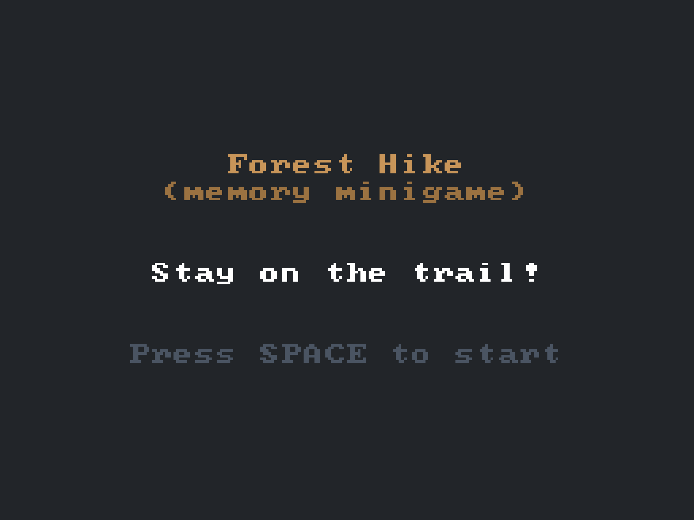
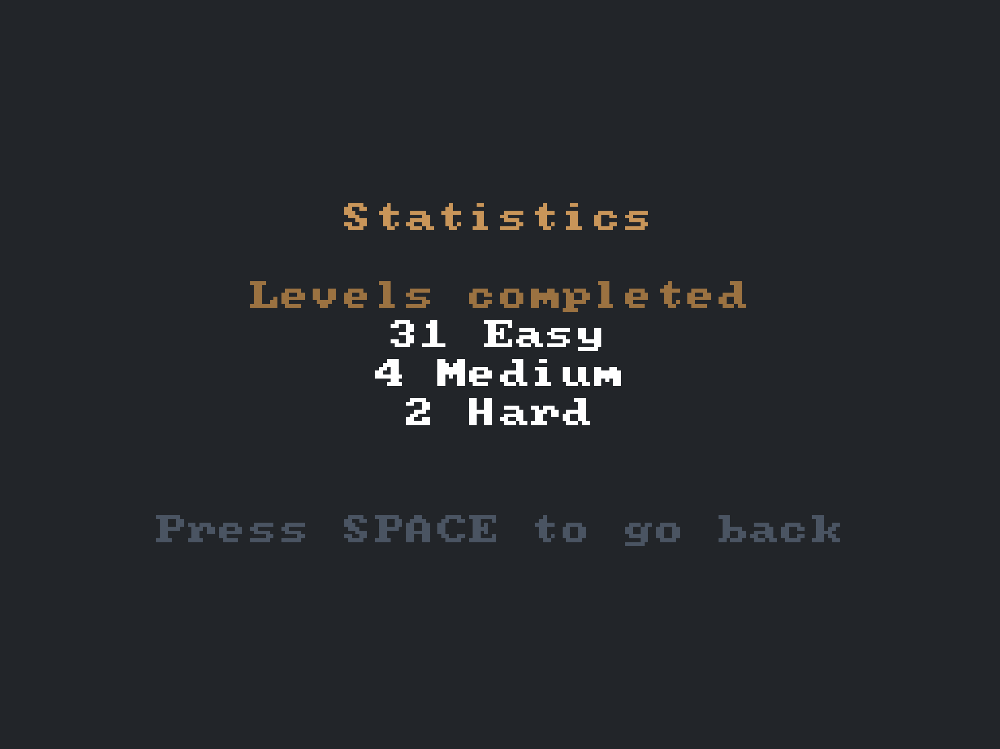
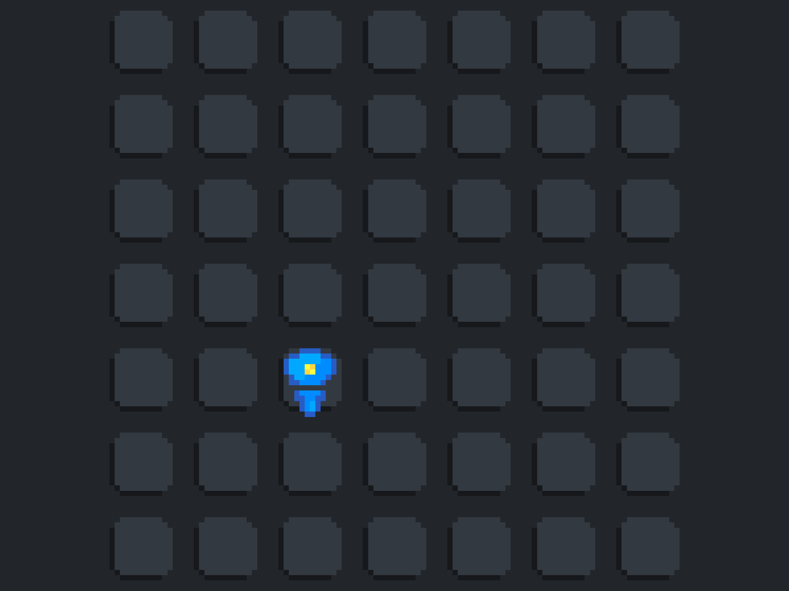
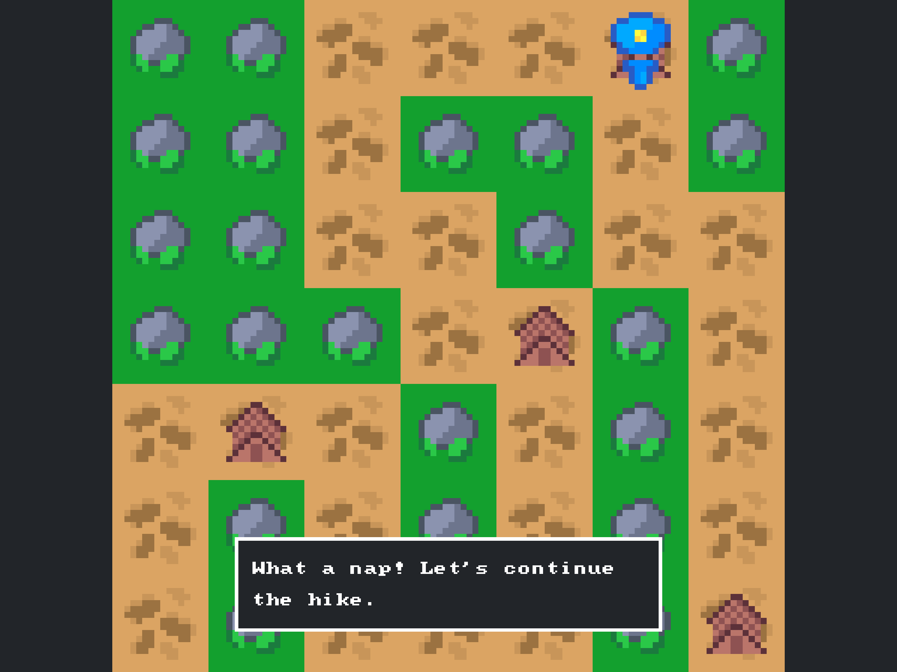
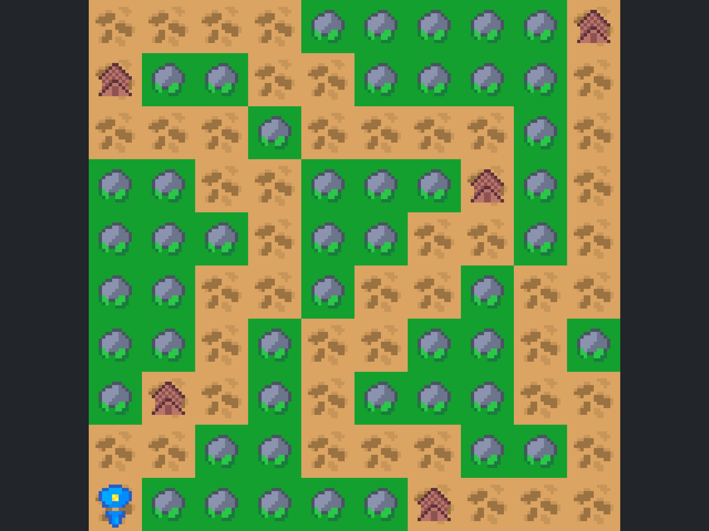

# Forest Hike 🌲

A browser-based memory training minigame where you navigate through a forest by remembering the correct path during daylight and then walking it in darkness.

**🎮 [Play the game](https://forest-hike.appwrite.network/)**

## 🎯 Game Concept

Forest Hike is a brain training game designed to improve your memory and spatial awareness. The gameplay follows this pattern:

1. **Daylight Phase**: Study the forest map and memorize the dirt road path
2. **Night Phase**: Navigate the same map in darkness, following the path from memory
3. **Checkpoint System**: Reach checkpoints to briefly see the map again before continuing
4. **Goal**: Successfully navigate to the final tent without getting lost in the trees

## 🎮 How to Play

- **Study the Map**: During daylight, carefully observe the dirt road winding through the forest
- **Stay on Path**: Walk only on the dirt road - stepping into trees will get you lost
- **Use Checkpoints**: Reach tent checkpoints to get another glimpse of the map
- **Complete the Journey**: Navigate all the way to the final destination

## 🏆 Difficulty Levels

The game offers three difficulty settings to challenge players of all skill levels:

### Easy 🟢

Great for first-time players, and playful kids.

### Medium 🟡

Great for experienced players, and kids who want a challenge.

### Hard 🔴

Great challenge for kids and adults alike.

## 🧠 Memory Training Benefits

Forest Hike helps improve:
- **Spatial Memory**: Remembering layouts and paths
- **Visual Memory**: Recalling map details and landmarks
- **Working Memory**: Holding information while navigating
- **Attention to Detail**: Noticing important path markers
- **Sequential Memory**: Remembering the order of turns and directions

## 🎯 Game Features

- **Progressive Difficulty**: Start easy and work your way up
- **Statistics Tracking**: Monitor your completed levels
- **Minimalist Design**: Focus on gameplay without distractions
- **Responsive Controls**: Smooth keyboard navigation
- **Forest Theme**: Immersive woodland atmosphere

## 🛠️ Technical Details

### Technologies

- **[Odyc.js](https://odyc.dev/)** - Simple JavaScript game engine for pixel games
- **[Odyc CLI](https://github.com/meldiron/odyc-cli)** - Asset management and sprite generation
- **Vanilla JavaScript** - Core game logic and scene management

### Project Structure

```
forest-hike/
├── assets/           # Game sprites and assets
├── scenes/           # Game scenes (menu, game, difficulty, etc.)
├── screenshots/      # Game screenshots for documentation
├── utils/           # Utility functions (map generation, etc.)
├── assets.js        # Generated sprite assets
├── assets.sh        # Asset build script
└── index.html       # Main game file
```

### Asset Management

The game uses Odyc CLI for sprite management:

```bash
# Install Odyc CLI
go install github.com/meldiron/odyc-cli@latest

# Generate assets
odyc-cli sprites -a ./assets -o assets.js
```

## 🖼️ Screenshots

| Menu | Difficulty Selection |
|------|---------------------|
|  |  |

| Daylight Map | Night Navigation |
|--------------|------------------|
|  |  |

| Easy maps | Hard maps |
|--------------------|------------|
|  |  |

## 🚀 Getting Started

### Playing Online
Simply visit [https://forest-hike.appwrite.network/](https://forest-hike.appwrite.network/) to play for free in your browser.

### Local Development

1. Clone this repository
2. Start HTTP server `npx http-server`
3. Visit `http://localhost:8080`

### Building Assets

If you modify sprites in the `assets/` directory:

1. Install Odyc CLI: `go install github.com/meldiron/odyc-cli@latest`
2. Run the build script: `./assets.sh`
3. Refresh your browser to see changes

## 📝 License

This project is open source under the [MIT License](./LICENSE). Feel free to fork, modify, and share!

---

**Ready to test your memory?** [Start your forest hike journey now!](https://forest-hike.appwrite.network/) 🌲🎮