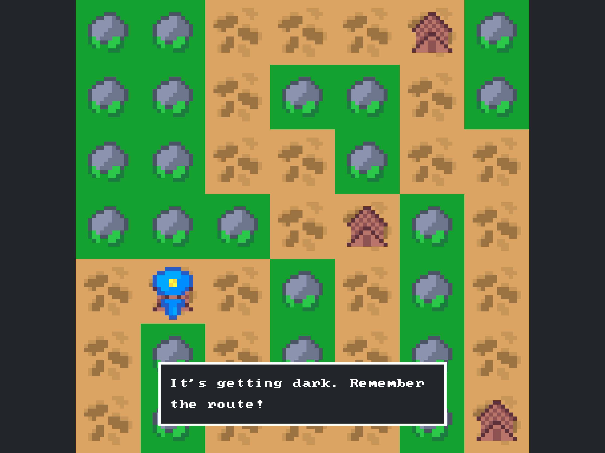

# Forest Hike 🌲

A browser-based memory training minigame where you navigate through a forest by remembering the correct path during daylight and then walking it in darkness.

**🎮 [Play the game](https://forest-hike.appwrite.network/)**

## 🎯 Game Concept

Forest Hike is a brain training game designed to improve your memory and spatial awareness. The gameplay follows this pattern:

1. **Daylight Phase**: Study the forest map and memorize the dirt road path
2. **Night Phase**: Navigate the same map in darkness, following the path from memory
3. **Checkpoint System**: Reach checkpoints to briefly see the map again before continuing
4. **Goal**: Successfully navigate to the final tent without getting lost in the trees

## 🎮 How to Play

- **Study the Map**: During daylight, carefully observe the dirt road winding through the forest
- **Stay on Path**: Walk only on the dirt road - stepping into trees will get you lost
- **Use Checkpoints**: Reach tent checkpoints to get another glimpse of the map
- **Complete the Journey**: Navigate all the way to the final destination

## 🏆 Difficulty Levels

The game offers three difficulty settings to challenge players of all skill levels:

### Easy 🟢
- **Path Length**: 12-15 segments
- **Checkpoint Gap**: Every 5 segments
- **Map Size**: 5x5 grid

### Medium 🟡
- **Path Length**: 25-30 segments  
- **Checkpoint Gap**: Every 7 segments
- **Map Size**: 7x7 grid

### Hard 🔴
- **Path Length**: 50-100 segments
- **Checkpoint Gap**: Every 7+ segments
- **Map Size**: Larger grid for maximum challenge

## 🛠️ Technical Details

### Built With
- **[Odyc.js](https://www.npmjs.com/package/odyc)** - Lightweight JavaScript game engine
- **Odyc CLI** - Asset management and sprite generation
- **Vanilla JavaScript** - Core game logic and scene management

### Project Structure
```
forest-hike/
├── assets/           # Game sprites and assets
├── scenes/           # Game scenes (menu, game, difficulty, etc.)
├── screenshots/      # Game screenshots for documentation
├── utils/           # Utility functions (map generation, etc.)
├── assets.js        # Generated sprite assets
├── assets.sh        # Asset build script
└── index.html       # Main game file
```

### Asset Management
The game uses Odyc CLI for sprite management:
```bash
# Install Odyc CLI
go install github.com/meldiron/odyc-cli@latest

# Generate assets
odyc-cli sprites -a ./assets -o assets.js
```

## 🖼️ Screenshots

| Menu | Difficulty Selection |
|------|---------------------|
|  |  |

| Daylight Map | Night Navigation |
|--------------|------------------|
|  |  |

| Mid-game Checkpoint | Statistics |
|--------------------|------------|
|  |  |

## 🚀 Getting Started

### Playing Online
Simply visit [https://forest-hike.appwrite.network/](https://forest-hike.appwrite.network/) to play immediately in your browser.

### Local Development
1. Clone the repository
2. Open `index.html` in your browser
3. Or serve with a local HTTP server:
   ```bash
   # Python
   python -m http.server 8000
   
   # Node.js
   npx serve .
   ```

### Building Assets
If you modify sprites in the `assets/` directory:
1. Install Odyc CLI: `go install github.com/meldiron/odyc-cli@latest`
2. Run the build script: `./assets.sh`
3. Refresh your browser to see changes

## 🧠 Memory Training Benefits

Forest Hike helps improve:
- **Spatial Memory**: Remembering layouts and paths
- **Visual Memory**: Recalling map details and landmarks
- **Working Memory**: Holding information while navigating
- **Attention to Detail**: Noticing important path markers
- **Sequential Memory**: Remembering the order of turns and directions

## 🎯 Game Features

- **Progressive Difficulty**: Start easy and work your way up
- **Statistics Tracking**: Monitor your completed levels
- **Minimalist Design**: Focus on gameplay without distractions
- **Responsive Controls**: Smooth keyboard navigation
- **Forest Theme**: Immersive woodland atmosphere

## 📝 License

This project is open source. Feel free to fork, modify, and share!

---

**Ready to test your memory?** [Start your forest hike journey now!](https://forest-hike.appwrite.network/) 🌲🎮